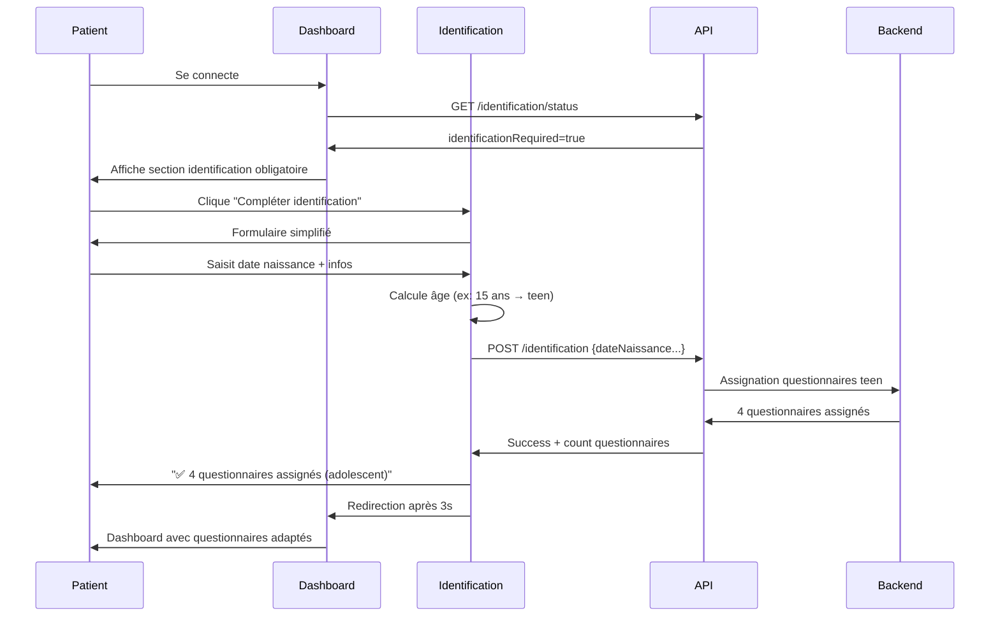

# Évolution des Dashboards V3.1 - Assignation Intelligente par Âge

## ✅ Implémentation Complétée

### 🎯 Objectifs Atteints

**Dashboard Patient Évolué :**

- ✅ Détection automatique du statut d'identification V3.1
- ✅ Affichage conditionnel selon l'âge (kid/teen/adult)
- ✅ Interface adaptée par groupe d'âge (vocabulaire, emojis, durées)
- ✅ Workflow d'identification obligatoire intégré
- ✅ Messages personnalisés selon l'âge

**Dashboard Praticien Enrichi :**

- ✅ Affichage de l'âge et du groupe d'âge des patients
- ✅ Statut d'identification visible en temps réel
- ✅ Badges visuels pour les questionnaires assignés par âge
- ✅ Interface adaptée pour le suivi multi-âges

### 🔧 Fonctionnalités Implémentées

#### 1. **Dashboard Patient (`/apps/patient-vite/src/pages/DashboardPage.tsx`)**

**Nouvelles interfaces :**

```typescript
interface PatientProfile {
  identificationRequired: boolean;
  identificationCompleted: boolean;
  ageGroup?: 'adult' | 'teen' | 'kid';
  age?: number;
  firstname?: string;
}
```

**Fonctionnalités ajoutées :**

- **Vérification du statut d'identification** via API `/api/patients/identification/status`
- **Section d'identification obligatoire** avec call-to-action visuel
- **Messages de félicitations** post-identification
- **Adaptation du vocabulaire** selon l'âge :
  - Enfants : "Tes prochaines actions", "Jouer", "Continuer le jeu"
  - Adolescents/Adultes : "Vos prochaines actions", "Commencer", "Continuer"
- **Affichage des questionnaires enrichi** :
  - Durée estimée (~15min)
  - Badge du groupe d'âge (Adulte/Ado/Enfant)
  - Message d'aide pour les enfants ("Papa ou maman peuvent t'aider")

**Workflow d'identification :**

```mermaid
graph TD
    A[Patient se connecte] --> B{Identification requise?}
    B -->|Oui| C[Affichage section identification obligatoire]
    B -->|Non| D[Dashboard normal]
    C --> E[Bouton "Compléter mon identification"]
    E --> F[Page identification simplifiée]
    F --> G[Assignation questionnaires par âge]
    G --> H[Message de succès + redirection]
```

#### 2. **Page d'Identification Simplifiée (`/apps/patient-vite/src/pages/IdentificationSimplePage.tsx`)**

**Nouvelle page optimisée pour V3.1 :**

- **Formulaire simplifié** axé sur l'âge et informations essentielles
- **Calcul automatique de l'âge** en temps réel
- **Affichage du groupe d'âge** (adulte/adolescent/enfant)
- **Auto-remplissage** depuis le profil Google/social
- **Appel API** `/api/patients/identification` pour assignation automatique
- **Feedback utilisateur** avec nombre de questionnaires assignés
- **Redirection automatique** vers les questionnaires

**Champs du formulaire :**

```typescript
interface IdentificationData {
  firstname: string; // Requis
  lastname: string; // Requis
  sexe: 'M' | 'F' | 'Autre'; // Requis
  dateNaissance: string; // Requis (calcul âge automatique)
  taille?: number; // Optionnel
  poids?: number; // Optionnel
  telephone?: string; // Optionnel
  profession?: string; // Optionnel
  personneUrgence?: string; // Optionnel
  telephoneUrgence?: string; // Optionnel
}
```

#### 3. **Dashboard Praticien (`/apps/practitioner-vite/src/pages/PatientsPage.tsx`)**

**Interface Patient enrichie :**

```typescript
interface Patient {
  // Champs existants...
  age?: number;
  ageGroup?: 'adult' | 'teen' | 'kid';
  identificationCompleted?: boolean;
  identificationRequired?: boolean;
  dateNaissance?: string;
}
```

**Améliorations visuelles :**

- **Affichage de l'âge** avec emoji 🎂
- **Badge du groupe d'âge** (Adulte/Ado/Enfant)
- **Statut d'identification** avec badges colorés :
  - 🆔 "Identification requise" (amber)
  - ✅ "Identifié" (emerald)
- **Questionnaires par âge** avec indication du groupe cible

#### 4. **Page Détail Patient (`/apps/practitioner-vite/src/pages/PatientDetailPage.tsx`)**

**En-tête enrichi :**

- **Affichage de l'âge et groupe d'âge** sous le nom
- **Statut d'identification** avec indicateurs visuels
- **Interface adaptée** pour le suivi multi-âges

### 🎨 Adaptations UX par Âge

#### **Enfants (≤12 ans) :**

```
- "Tes prochaines actions"
- "Jouer" au lieu de "Commencer"
- "Continuer le jeu" au lieu de "Continuer"
- "Papa ou maman peuvent t'aider"
- Emojis et vocabulaire ludique
- Badge "Enfant" en orange
```

#### **Adolescents (13-18 ans) :**

```
- Vocabulaire moderne avec emojis
- Badge "Ado" en bleu
- Interface équilibrée entre ludique et sérieuse
```

#### **Adultes (18+ ans) :**

```
- Vocabulaire professionnel
- Badge "Adulte" en vert
- Interface classique et épurée
```

### 📊 Tableau de Bord Intelligent

#### **Sections Conditionnelles :**

1. **Identification Obligatoire** (si `identificationRequired=true`)

   ```jsx
   <section className="rounded-2xl border border-amber-500/30 bg-amber-500/5 p-6">
     <h3>🎯 Identification obligatoire</h3>
     <p>Pour vous proposer des questionnaires adaptés...</p>
     <button>Compléter mon identification</button>
   </section>
   ```

2. **Message de Félicitations** (si `identificationCompleted=true`)

   ```jsx
   <section className="rounded-2xl border border-emerald-500/30 bg-emerald-500/5 p-6">
     <h3>✅ Profil complété !</h3>
     <p>Questionnaires adaptés pour {ageGroup}</p>
   </section>
   ```

3. **Questionnaires Enrichis**

   ```jsx
   <div className="text-xs text-white/60">
     Assigné il y a 2h • ~15min
     <span className="badge">Enfant</span>
   </div>
   ```

### 🔄 Workflow Complet V3.1



### 🚀 Fonctionnalités Futures

#### **Prochaines Étapes :**

1. **Tests E2E** du workflow complet
2. **Analytics** par groupe d'âge
3. **Notifications** adaptées par âge
4. **Rapports praticiens** segmentés par âge
5. **Interface parent/enfant** collaborative

#### **Extensions Possibles :**

- **Modes d'affichage** (parent/enfant, autonome)
- **Gamification** pour les enfants
- **Questionnaires collaboratifs** parent-enfant
- **Suivi développemental** par âge

---

**🎯 Dashboard V3.1 déployé avec succès !**

Les utilisateurs bénéficient désormais d'une expérience personnalisée selon leur âge, avec une assignation intelligente de questionnaires et une interface adaptée à chaque groupe démographique.
