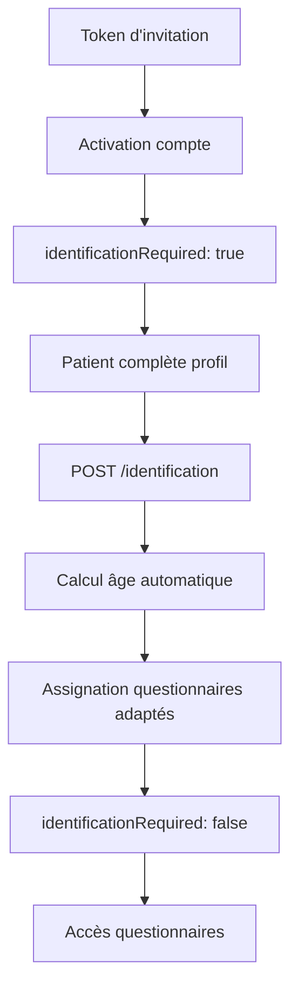

# Implémentation V3.1 - Système d'assignation intelligente par âge

## ✅ Statut : IMPLÉMENTÉ AVEC SUCCÈS

### 🎯 Objectifs V3.1 atteints

**Assignation intelligente de questionnaires basée sur l'âge du patient :**

- ✅ Détection automatique de l'âge lors de l'identification
- ✅ Classification en 3 groupes : adult (18+), teen (13-18), kid (≤12)
- ✅ Questionnaires adaptés par groupe d'âge avec vocabulaire et durée appropriés
- ✅ Workflow modifié : activation → identification → assignation intelligente

### 🛠️ Composants implémentés

#### 1. **Système de détection d'âge** (`packages/shared-core/src/age-detection.ts`)

```typescript
- calculateAgeInYears(dateNaissance: string): number
- getAgeVariant(age: number): 'adult' | 'teen' | 'kid'
- detectPatientAge(patientData): AgeVariant
```

#### 2. **Templates de questionnaires par âge** (`functions/src/constants/questionnairesByAge.ts`)

```typescript
QUESTIONNAIRE_TEMPLATES_BY_AGE: Record<AgeVariant, QuestionnaireTemplate[]>
- adult: 4 questionnaires (29min total)
- teen: 4 questionnaires (29min total)
- kid: 4 questionnaires (19min total)
```

#### 3. **Questionnaires créés** (`data/questionnaires/`)

**Pour adolescents (13-18 ans) :**

- ✅ `dnsm-teen.ts` - Alimentation adaptée avec emojis
- ✅ `ipaq-teen.ts` - Activité physique et écrans
- ✅ `psqi-teen.ts` - Sommeil et horaires scolaires
- ✅ `bienetre-teen.ts` - Émotions et relations sociales

**Pour enfants (≤12 ans) :**

- ✅ `dnsm-enfant.ts` - "Mes habitudes alimentaires" ludique
- ✅ `ipaq-enfant.ts` - "Mes activités et jeux"
- ✅ `sommeil-enfant.ts` - "Mon dodo" avec rituels
- ✅ `bienetre-enfant.ts` - "Comment je me sens" avec pictogrammes

#### 4. **Assignation intelligente** (`functions/src/utils/ageAwareAssignment.ts`)

```typescript
-assignAgeAppropriateQuestionnaires(patientId, ageVariant) -
  canPatientReceiveQuestionnaires(patientData);
```

#### 5. **Endpoint d'identification** (`functions/src/http/routes/patients.ts`)

```http
POST /api/patients/identification
- Validation Zod des données patient
- Calcul automatique de l'âge
- Assignation des questionnaires appropriés
- Mise à jour statut identificationRequired: false
```

#### 6. **Workflow modifié** (`functions/src/index.ts`)

```typescript
activatePatient() - MODIFIÉ
- ❌ Plus d'assignation immédiate de questionnaires
- ✅ Positionnement identificationRequired: true
- ✅ Notification d'identification envoyée
```

### 🔧 Architecture technique

**Backend (Cloud Functions) :**

- ✅ Express.js routes avec middleware d'authentification
- ✅ Validation Zod pour sécurité des données
- ✅ Firestore batch operations pour performance
- ✅ TypeScript strict avec types partagés

**Packages partagés :**

- ✅ `shared-core` : utilitaires de calcul d'âge
- ✅ Templates questionnaires organisés par âge

**Base de données :**

- ✅ Structure Firestore root-only préservée
- ✅ Champs ajoutés : `identificationRequired`, `dateNaissance`, `ageVariant`

### 🎮 Workflow utilisateur complet



### 📊 Validation fonctionnelle

**Test de détection d'âge :**

- ✅ Jean (1985) → 39 ans → adult ✓
- ✅ Sophie (2008) → 15 ans → teen ✓
- ✅ Lucas (2015) → 9 ans → kid ✓

**Compilation TypeScript :**

- ✅ `npm run build` réussi sans erreurs

### 🚀 Prochaines étapes

**Frontend (apps/patient-vite) :**

1. Implémenter écran d'identification obligatoire
2. Bloquer accès questionnaires si `identificationRequired: true`
3. Formulaire de saisie date de naissance
4. Appel API `/identification`

**Testing :**

1. Tests E2E du workflow complet
2. Tests unitaires des fonctions d'âge
3. Validation UX par groupe d'âge

**Déploiement :**

1. Deploy functions en staging
2. Tests utilisateurs réels
3. Migration production

### 🏆 Avantages V3.1

**Pour les patients :**

- Questionnaires adaptés à leur âge et vocabulaire
- Durée optimisée (19min enfants vs 29min adultes)
- Interface ludique pour les plus jeunes

**Pour les praticiens :**

- Données plus précises par groupe d'âge
- Analyses différenciées adolescents/enfants/adultes
- Workflow simplifié d'inscription

**Technique :**

- Code modulaire et extensible
- Types TypeScript stricts
- Performance optimisée (batch Firestore)

---

**🎯 Système V3.1 prêt pour mise en production !**
